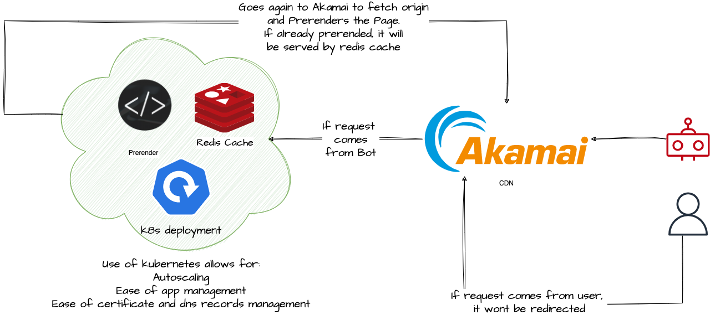

# Linode Prerender Use Case

The idea of this setup is to provide a scalable and reliable way to prerender javascript content in case of bot asks for the content.

If curious about prerendering and SEO, you can check this post: https://www.rankmovers.com/understanding-pre-rendering-in-seo/

## Preparing the setup.

To recreate this setup, you will require:

--> A kubernetes cluster, with right access configured to the api (in this case, a LKE cluster will be used)  

--> kubectl installed  

--> helm installed

--> Certificates for the prerender endpoint. You can bring your own, or generate it with lets encrypt as will be done for this case

--> A domain name you could use for the setup that can resolve. (In this case, Akamai Edge DNS will be used)

--> This setup assumes you have an akamai property delivering the website you plan to prerender and is working correctly.


## Arquitecture overview




## Kubernetes Setup

### 1-Install NGINX ingress


```bash
helm repo add ingress-nginx https://kubernetes.github.io/ingress-nginx
```

```bash
helm repo update
```

```bash
helm install ingress-nginx ingress-nginx/ingress-nginx
```

**This will create a loadbalancer type of service, in case of linode a node balancer.

### 2-Install cert manager (this one in case you dont bring your own script, if that is the case look at step 3)

```bash
kubectl apply -f https://github.com/cert-manager/cert-manager/releases/download/v1.8.0/cert-manager.crds.yaml
```

```bash
kubectl create namespace cert-manager
```

```bash
helm repo add cert-manager https://charts.jetstack.io
```

Verify the pods are running:

```bash
kubectl get pods --namespace cert-manager
```

### 3-Run the cluster issuer

Inside the kubernetes folder, you will find a file named clusterissuer.yaml. An Issuer or ClusterIssuer identifies which Certificate Authority cert-manager will use to issue a certificate.

```bash
cd kubernetes/
```

You can edit the name field, email and privateKeySecretRef as required.

```bash
kubectl apply -f clusterissuer.yaml
```

### 4-Run External DNS

In the same kubernetes folder a file named externaldnssetup.yaml will be found.

You need to run it to be able to generate records for the prerender endpoint, But first you need to edit some fields and create other resources as required:

Line 56 - --provider=akamai: In this case, make sure you setup the correct dns server provider, you can check the available providers in here: https://github.com/kubernetes-sigs/external-dns

Line 57 --domain-filter: Make sure you place the domain you want to administer so that external dns dont change any other domain.

In case of Akamai provider, you will need to create a secret with the akamai api credentials required.

```bash
k create secret generic external-dns  \
--from-literal=EXTERNAL_DNS_AKAMAI_SERVICECONSUMERDOMAIN={your Akamai api domain name}  \
--from-literal=EXTERNAL_DNS_AKAMAI_CLIENT_TOKEN={your Akamai api client token}  \
--from-literal=EXTERNAL_DNS_AKAMAI_CLIENT_SECRET={your Akamai api client secret}  \
--from-literal=EXTERNAL_DNS_AKAMAI_ACCESS_TOKEN={your Akamai api client access token} --dry-run=client -o yaml > externa_dns.yaml
```

Then, you can run the external dns deployment file::

```bash
kubectl apply -f external_dns.yaml
```

Check the instructions required according to your dns provider.  


### 5-Run the prerender components

```bash
kubectl apply -f prerenderDeploy.yaml
```

```bash
kubectl apply -f prerenderSvc.yaml
```

### 6-Run the ingress

The ingress will be the component that will route our requests to the prerender app and will create.

First, edit some of the fields of ingress.yaml accordingly:

Line 7 cert-manager.io/cluster-issuer: "name of cluster issuer": Make sure it matches the cluster issuer name you set on step 3.

Line 8 external-dns.alpha.kubernetes.io/hostname: "www.example.com": This will add an entry of your dns domain, for example www in this case. Make sure the domain matches what you set on the external dns file on previous step.

Line 14 secretName: "name of secret specified on cluster issuers": Make sure it matches the privateKeySecretRef you setup on step 3. 

Line 17 - "www.example.com" (below hosts field): Make sure it matches Line 8.

Finally, create the ingress:


```bash
kubectl apply -f ingress.yaml
```

A new record poiting to the ip of the nginx ingress load balancer should be created/propagated from your dns provider.

## Akamai CDN

This step is very simple. We will make our property redirect all requests that come from a bot to the prerender enpoint on kubernetes.


### 1-Create the origin rule for the prerender origin

Go and edit the property on a new version.

Add a blank rule, you can name it to something meaninful like "prerender redirection"


Add a Match. It will be User Agent, and it will match any bots that might send requests to your site.


### 2-Add behaviors to the rule

Add a new behavior of type "Origin Server"


Configure this new origin as you would any other origin, using the prerender dns record we generated on the kubernetes section. Make sure the Forward Host Header and Cache Key Hostname fields are set to origin hostname.


Add another behavior of type Modify Outgoing Request Path. On action select Replace the entire path, and on the Replace with, add the following:
```
/{{builtin.AK_SCHEME}}://{{builtin.AK_HOST}}{{builtin.AK_URL}}
```
This will make our prerender origin to send the request using the original origin in order to prerender all the javascript on the page.


Save and activate your property.

You can test your setup issuing:

```bash
curl --silent -v -k https://www.yoursite.com
```

```bash
curl -A Google --silent -v -k https://www.yoursite.com #Set google bot as user agent
```

You will notice that the request with the bot, will render all javascript on the html response, which is the idea.


